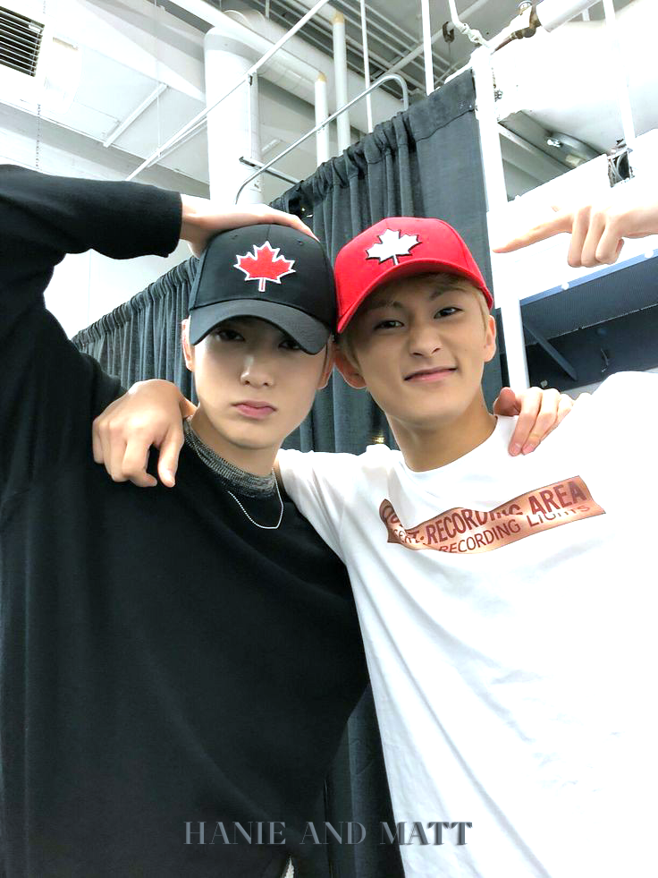

<html>
<head>
	<title>KEATT</title>
	<link rel="stylesheet" type="text/css" href="FORMATO 2yrs.css">
</head>
<body> 
	<font:CRONISSE>
	<h1><u>
HANIE AND MATT
</u></h1>
	<DL>
			<DT></DT>
	<H3>

	
		Hoy estamos cumpliendo dos años juntos e insisto que el tiempo a tu lado pasó volando, ¿qué no hemos pasado junto en estos años? creo que hicimos casi de todo y quiero agradecerte por todo este tiempo que estuviste conmigo, siempre he podido contar contigo, estuviste en cada momento de mi vida, compartiendo risas como llantos (más de mi parte), hemos ido creando varios recuerdos que me gusta mencionar de vez en cuando en nuestras pláticas o contarlas a conocidos, decirles algo como "sí, con mi novio hicimos esto" o algo como "uhum, la otra vez con mi prometido" y más cosas por el estilo donde siempre termino por mencionarte inconscientemente, un día de estos me dirán "hanma, ya basta, ya sabemos sobre tu novio".
	
	
		Cada día a tu lado es una sorpresa, siempre hay algo nuevo de lo que podemos hablar y eso me encanta, tal vez no te lo comente, pero un mensajito tuyo ya me tiene sonriendo como tonto todo el rato, eres muy simpático. Quiero continuar a tu lado, sé que no soy el mejor (ante los demás sí, obviamente) y que debo mejorar algunas cosas, pero ten por seguro que solo quiero hacerte feliz por más que haga mis tonterías, te pido perdón por ello y todas las veces que te hice pasar un mal momento, también gracias por darme tu confianza, contarme como te sientes, eso es muy importante para mí. 
	

		Bueno, esto parece más mis disculpas que unas palabras por nuestros dos años.
		Creo te lo dije hace un tiempo, pero no está mal recordarlo de vez en cuando, eres mi adoración y hay algo que no te he dicho directamente por pena desde que volví de aquel tiempo que te pedí, así que por aquí lo hago, tal vez en este punto esté todo nerviosa, pero ajá. Esos días en los que no estuvimos juntos, se sintieron una tortura, hablo enserio, tenía que mantenerme ocupado para poder despejar mi mente y no sobrepensar las cosas, pero como siempre, en la noche todo se me venía encima, no sé cuántas veces estuve con krevan y hiraeth llorando por lo mismo, en ese tiempo pude confirmar que sin ti no sé qué haría, a este punto de mi vida estoy tan acostumbrado a ti que si no te tengo, se siente un gran vacío que no podría explicarlo muy bien, pero no deseo repetirlo de nuevo, me hiciste muchísima falta y era peor cuando no sabía cómo hablarte de nuevo hasta esa vez por la noche e incluso estaba nervioso por un posible rechazo tuyo, las cosas estaban algo mmmmmm desde mi lugar. Luego cuando volvimos hablar poco a poco, mi ánimo comenzó a subir hasta ese día donde tuvimos el malentendido con que el otro no había respondido, debo admitir que me chocó el haber estado hablando normal y que de la nada hayamos vuelto a lo mismo de antes, pero lo solucionamos, ahora me siento mejor, con más ánimos y tranquilo, creo que después de todo debió servir de algo mi descanso, supongamos que sí sirvió.
	

		Ahora, como sabrás, me quedé medio traumadito con usar apk, así que decidí aprovechar esto para dejarte una pequeña lista de canciones que me gustaría dedicarte, por favor omitamos las partes obscenas que algunas canciones tienen y al último te dejé algo más, espero te gusten, perdón si no son lo que esperabas para nuestro aniversario, te amo.
	

		<MENU>
			<h4><li>PLAYLIST KEATT
			<meta name="viewport" content="width=device-width, initial-scale=1"> 

			<link rel="stylesheet" href="https://cdnjs.cloudflare.com/ajax/libs/font-awesome/4.7.0/css/font-awesome.min.css"><i class="fa fa-youtube-play" style="font-size:20px"></i></li>
			
			

				<table BORDER CELLPADDING=10 CELLSPACING=1  bordercolor="#A18594">
				<tr>
					<h4><td><b>
Canción
</b></td> <td><b>
Artista
</b></td> <td><b>
Link
</b></td> <td><b>
Motivo
</b></td></h4>
				</tr>
				<tr>
					<td>
Yonaguni
</td> <td>
Bad Bunny
</td> <td><ul><a href="https://www.youtube.com/watch?v=doLMt10ytHY" target="_blank">www.youtube.com/watch?v=doLMt10ytHY</a></ul></td> <td>Cuando escuché esta canción, al instante se me vino que debía dedicártela y por eso es que en su momento te la mandé, si omitimos ciertas partes, describe un poco como es que empezamos nuestra relación y hay partes donde explica como me sentía cuando me iba enamorando de ti, además que quiero empezar el 2023 contigo, simplemente la canción es perfecta.</td>
				</tr>
				<tr>
					<td>
Moscow Mule
</td> <td>
Bad Bunny
</td> <td><ul><a href="https://www.youtube.com/watch?v=NBghhjuMNKM" target="_blank">www.youtube.com/watch?v=NBghhjuMNKM</a></ul></td> <td>Esta canción también me recuerda a ciertos momentos que pasamos, en ese entonces donde tú y yo nos íbamos para tomarnos un tiempo (tú) o de fiesta (yo), el no saber si al día siguiente estarías conmigo o te irías de sorpresa como solías hacerlo, "no somos nah, pero estamos envueltos hace rato".</td>
				</tr>
				<tr>
					<td>
A tu merced
</td> <td>
Bad Bunny
</td> <td><ul><a href="https://www.youtube.com/watch?v=ublf6qfpuuo" target="_blank">www.youtube.com/watch?v=ublf6qfpuuo</a></ul></td> <td>Creo que es re obvio el motivo para que esta canción esté en la lista, el nombre de la canción lo dice todo, me tienes como quieres.</td>
				</tr>
				<tr>
					<td>
Efecto
</td> <td>
Bad Bunny
</td> <td><ul><a href="https://www.youtube.com/watch?v=yO-XR4qXm1k" target="_blank">www.youtube.com/watch?v=yO-XR4qXm1k</a></ul></td> <td>No recuerdo muy bien si llegué a decirte en algún momento que te dedicaba esta canción, solo que la ponía una y otra vez en rave cuando fuimos con rave jasdjajsd, en fin, otra canción que practicamente habla de como me tienes por ti.</td>
				</tr>
				<tr>
					<td>
Dos mil 16
</td> <td>
Bad Bunny
</td> <td><ul><a href="https://www.youtube.com/watch?v=9Vbv9ulhwXw" target="_blank">www.youtube.com/watch?v=9Vbv9ulhwXw</a></ul></td> <td>De esta canción sí te he cantado un poquito la otra vez que estábamos hablando, creo la letra es más uhmmmmm, pero hagamos como que dice cosas bonitas y no cochinadas.</td>
				</tr>
				<tr>
					<td>
Yo no soy celoso
</td> <td>
Bad Bunny
</td> <td><ul><a href="https://www.youtube.com/watch?v=Fd9LvlEi8uY" target="_blank">www.youtube.com/watch?v=Fd9LvlEi8uY</a></ul></td> <td>Bueno, esta canción no es mucho por ese lado de dedicar, es más como expresar algo que sentía en su momento y llegué a comentarlo en una ocasión, sé que siempre he dicho que no soy alguien de celos, pero habían veces donde sentía esa molestia en algunos casos y me quedaba cuestionando la actitud que quería tomar, creo que la parte que mejor da a entender como me sentía es:
					 "Enamorao por aquí, enamorao por allá
					 Cupido, basta ya
					 Te quiero pa mí na más, y eso es egoísmo"</td>
				</tr>
				<tr>
					<td>
Sessions #52
</td> <td>
Quevedo|BZRP
</td> <td><ul><a href="https://www.youtube.com/watch?v=A_g3lMcWVy0" target="_blank">www.youtube.com/watch?v=A_g3lMcWVy0</a></ul></td> <td>Esos días que nos estuvimos juntos, esta canción fue de las que más estuve escuchando, me recordaba a ti de cierta forma, fue una mezcla de sentimientos y pegaba más fuerte cuando llegaba esa parte donde dice: "Quédate que las noches sin ti duelen"</td>
				</tr>
				<tr>
					<td>
La más bella
</td> <td>
Afrodisiaco
</td> <td><ul><a href="https://www.youtube.com/watch?v=cTNVXHHCP7U" target="_blank">www.youtube.com/watch?v=cTNVXHHCP7U</a></ul></td> <td>Aprovecho para poner esta canción ahora,me hubiese gustado ponértela en una de nuestras salidas a rave, pero ya ves jaja, igual para mí y kev, ya te la dediqué. Es algo gracioso como es que conocí la canción, es de una "pareja" de una serie de acá, donde una chica de dinero no quiere estar con el chico de bajos recursos por la misma razón, este siempre intenta acercarse por más que lo trate feo, ve por ella y quiere protegerla, ganándose en el proceso uno que otro problema, pero la chica solo sigue rechazándolo, negándose a sentir algo por el tipo, ¿no se te hace muy conocida esa historia? a mí sí.</td>
				</tr>
				<tr>
					<td>
Llamado de emergencia
</td> <td>
Daddy Yankee
</td> <td><ul><a href="https://www.youtube.com/watch?v=lsx1Ops1sI8" target="_blank">www.youtube.com/watch?v=lsx1Ops1sI8</a></ul></td> <td>Bueno, volviendo a hanie dramático como siempre, esta canción también explica como estuve sin ti, así estaría si ya no te tengo a mi lado, me harías mucha falta, mis signos vitales van disminuyendo, ah decía.</td>
				</tr>
				<tr>
					<td>
Lovumba
</td> <td>
Daddy Yankee
</td> <td><ul><a href="https://www.youtube.com/watch?v=JC_xUGs6sY4" target="_blank">www.youtube.com/watch?v=JC_xUGs6sY4</a></ul></td> <td>No es posible que te haya hecho un video con esta canción y no te la haya dedicado directamente, o sea, es MUY nosotros a mi parecer, siempre hemos mencionado que solemos ser muy distintos en ciertas cosas y eso nos complementa, esta canción me recuerda eso.</td>
				</tr>
				<tr>
					<td>
As If It's Your Last
</td> <td>
BLACKPINK
</td> <td><ul><a href="https://www.youtube.com/watch?v=XihzkJf408s" target="_blank">www.youtube.com/watch?v=XihzkJf408s</a></ul></td> <td>Suspiro enamorado, todas esas veces que t digo que me haces sentir como en un comienzo, la emoción, los nervios y muchas más emociones, esta canción explica como me siento en esos momentos.</td>
				</tr>
				<tr>
					<td>
The Feels
</td> <td>
TWICE
</td> <td><ul><a href="https://www.youtube.com/watch?v=ORwBniKpM9U" target="_blank">www.youtube.com/watch?v=ORwBniKpM9U</a></ul></td> <td>Otra canción que explica como es que me siento cuando estoy a tu lado, sí, por.</td>
				</tr>
				<tr>
					<td>
Blue Hour
</td> <td>
TXT
</td> <td><ul><a href="https://www.youtube.com/watch?v=iqpQgCaBEYY" target="_blank">www.youtube.com/watch?v=iqpQgCaBEYY</a></ul></td> <td>La pongo porque puedo y quiero, no entro en detalles, es lo mismo que con BP y TWICE</td>
				</tr>
				<tr>
					<td>
Highway to Heaven
</td> <td>
NCT 127
</td> <td><ul><a href="https://www.youtube.com/watch?v=m1X7J5ugmGU" target="_blank">www.youtube.com/watch?v=m1X7J5ugmGU</a></ul></td> <td>ES RE OBVIO, FIN.</td>
				</tr>
				<td>Middle of the Night</td> <td>Elley Duhé</td> <td><ul><a href="https://www.youtube.com/watch?v=iqpQgCaBEYY" target="_blank">www.youtube.com/watch?v=iqpQgCaBEYY</a></ul></td> <td>Y ya finalizando con todo, te dejo esta canción que en su momento te mencioné era especial y estoy seguro de querer dedicártela, no quiero entrar en muchos detalles, creo la letra habla por sí sola.</td>

				</table>

			<h3><LI>DRIVE
				<meta name="viewport" content="width=device-width, initial-scale=1">

				<link href="https://fonts.googleapis.com/icon?family=Material+Icons" rel="stylesheet">
				<i class="material-icons" style="font-size:20px">folder</i>
				</LI>
		

			<DT> 
		  
		 
		 
		 
		 
		 
<a href="https://drive.google.com/drive/folders/1euKtye_rkWT500olWbnNrJfGJl9o-b-S?usp=sharing" target="_blank">drive.google.com/drive/folders/1euKtye_rkWT500olWbnNrJfGJl9o-b-S?usp=sharing

	

		
</body>
</html>
